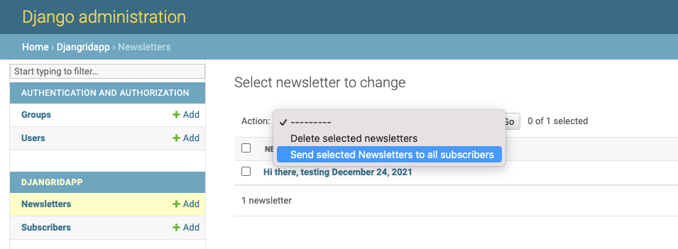
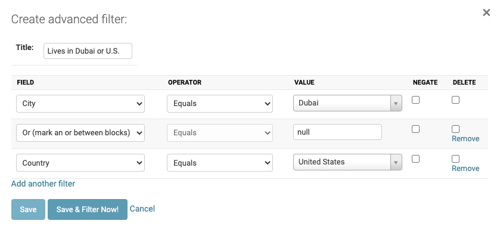
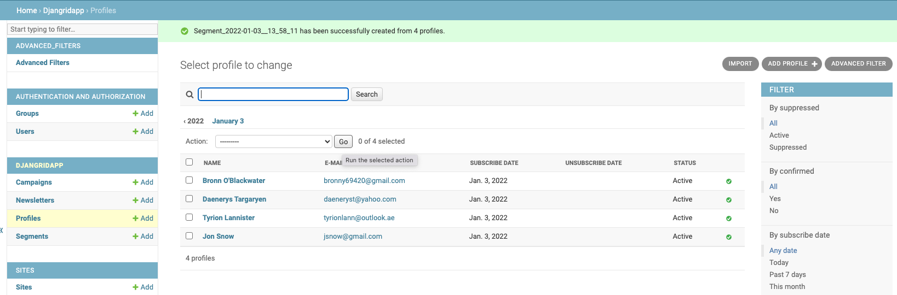
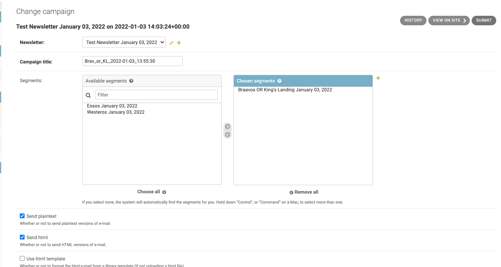

# Djangrid
#### Django email marketing web app utilising the SendGrid API
Djangrid is a fork of [django-newsletter](https://github.com/jazzband/django-newsletter), with a slightly different process design, similar to [Klaviyo](https://www.klaviyo.com/). Djangrid has additional features such as the ability to create list segments based on subscribers' behaviour or properties, the ability for bulk CSV uploads to include properties such as location or other metadata to create user Profile fields dynamically, and the ability to schedule campaigns from the Django Admin panel without needing to manually add crontab entries.
It also allows the use of Django HTML template tags for emails. e.g. "Hi {{ first_name }}".

The repository can be found at:
[Github-Djangrid](https://github.com/Saran33/Djangrid/)

#### To install from git:
`mkdir Djangrid`
`cd Djangrid`
`pip install git+git://github.com/Saran33/Djangrid.git`

# SendGrid API Setup
- Create account and API key.
e.g. (not a real API key)
```zsh
cd djangrid # navigate to the Djangrid/djangrid directory
echo "export SENDGRID_API_KEY='SG.Ggergre9v3_RrgegNufeu9rsQ.9t9HregtU6fUegsggne9hZ6NcJiQEc'" > sendgrid.env
echo "sendgrid.env" >> .gitignore
source ./sendgrid.env
```

# Django Setup
`python manage.py makemigrations`
`python manage.py migrate`
1. In settings.py, change the FROM_EMAIL and SENDGRID_API_KEY (bottom of the file).
2. `python manage.py createsuperuser`
USER: `testuser`
PASS: `SOME_PASSWORD`
```zsh
python manage.py makemigrations
python manage.py migrate
```
3. `python manage.py runserver`
- Go to http://127.0.0.1:8000/admin/ and log in.
4. test the sign-up screen at: http://127.0.0.1:8000/newsletter/subscribe/
- Change the name of the site in the `Sites` tab of the Admin Panel from 'example.com' to your site.
- Enter an email address to subscribe with.
- When you recieve a confirmation email, click the link to confirm.
- The new subscriber should now be verified in the admin dashboard.
5. Use the admin dashboard to upload HTML formatted newsletters (dashboard supports file uploads)
- Upload the test_email.html located in the Djangrid/djangrid/newsletters folder.
6. You can send the email to all subscribers, as an admin action in the 'Newsletters' tab of the admin panel.
- Click the checkbox beside the newsletter.
- In the above 'action' dropdown menu, select 'Send selected Newslwtters to all subscribers' (Note, this option will only be available if there are one or more subscribers registered with confirmed emails).
- Click the 'Go' button.

- The newsletter should be sent to all subscribers.

Subscribers can also be manually added within the admin dashboard. This will not send an email notification for confirming the email address.
- Subscribers can be added individually or by bulk uploading a csv containing the column names as per the example test_list.csv file.

### Create Segments
- Subscribers can be grouped into segments based on their behaviour or properties, such as their geographical location, utilising [django-advanced-filters](https://github.com/modlinltd/django-advanced-filters)
- In Django admin, go to the `Profiles` tab and click the `Advanced Search` button. Filter profiles as per the below image:

- Click `Save & Filter Now`, then check the boxes for all the profiles returned by the search.
- In the Profile Actions dropdown menu, select `Create segment from selected`, then press `Go` to create the segment.
- The newly created segment should now be available in the `Segments` tab, located in the left app admin menu.
- The segment will be named 'Segment ... + the current date & time'. Click on it to update the name and then hit save.


### Creating a Campaign
- A campaign represents an email either scheduled or submitted for immediate sending to a list or segment of user profiles.
- To create a campaign, in the left app admin menu, click `Campaigns`, then click the `Add Campaign` button.
- Select an existing newsletter to use and select a title. Then choose the segment or segments to use as recipients for the campaign.
- To send the email in both plaintext and html, check both the `Send plaintext` and `Send html` boxes. This ensures maximum deliverability.
- If the html file for the email has been uploaded, there is no need to check the `Use html template` box. This box is to be checked only if writing the email manually and using a template from the template library (that feature is not avialable yet).
- Click `Save & Continue editing`, then click the `Submit` button to schedule the campigin for sending.

- To send the campiagn immediately, open a terminal in the Djangrid/djangrid directory and run: `python manage.py submit_campaign`.
- The campaign should now be sent.

### Scheduling a Campaign
- To schedule a campaign for future sending, create a crontab entry for the submit_campaign management command.
`EDITOR=nano crontab -e`
- e.g. to send it in 15 minutes time:
`*/15 * * * * (cd <project_root> && <path_to_virtualenv>/bin/python3.10 <project_root>/manage.py submit_campaign 1>/dev/null 2>&1)`
- (A campaign will only be sent once, so a cron entry will not send it every 15 minutes).
- e.g. for sending at 12:03 p.m on the 27th of December:
`12 03 27 12 MON (cd <project_root> && <path_to_virtualenv>/bin/python3.10 <project_root>/manage.py submit_campaign 1>/dev/null 2>&1)`
- For more crontab timing format examples, see: https://crontab.guru/examples.html
- To check scheduled crontab jobs:
`crontab -l`

### TODO
- Allow cron jobs to be created in Django, based on selected 'send_datetime' for each campaign, using [python-crontab](https://pypi.org/project/python-crontab/)